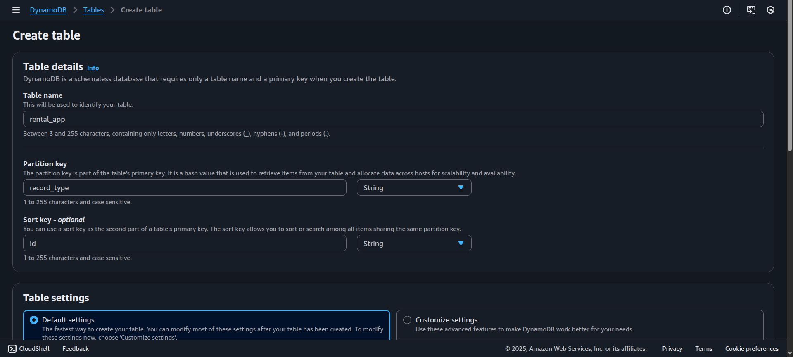
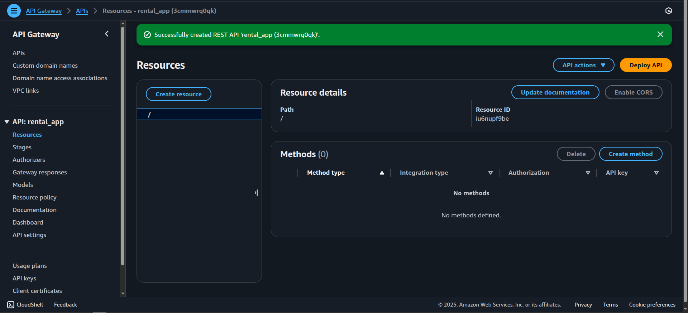
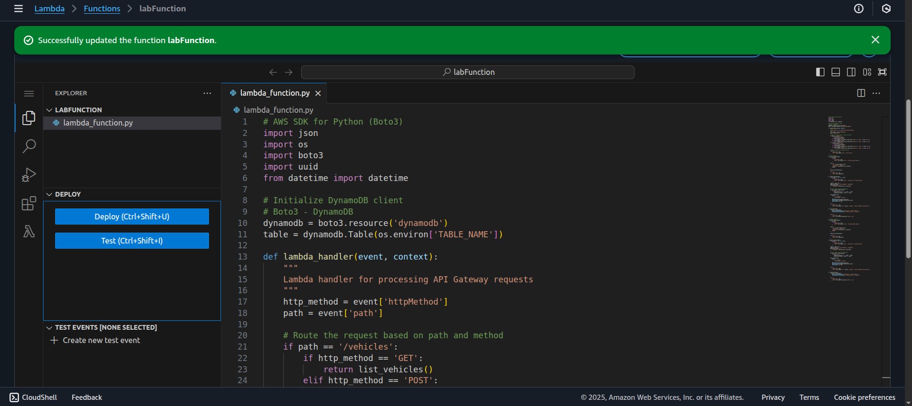
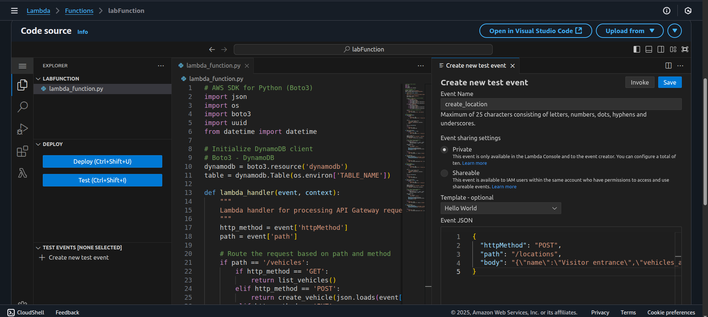
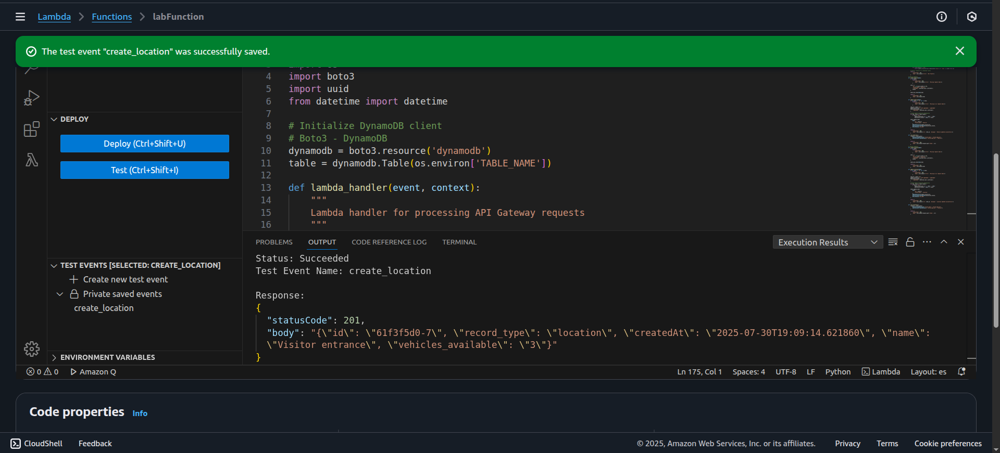
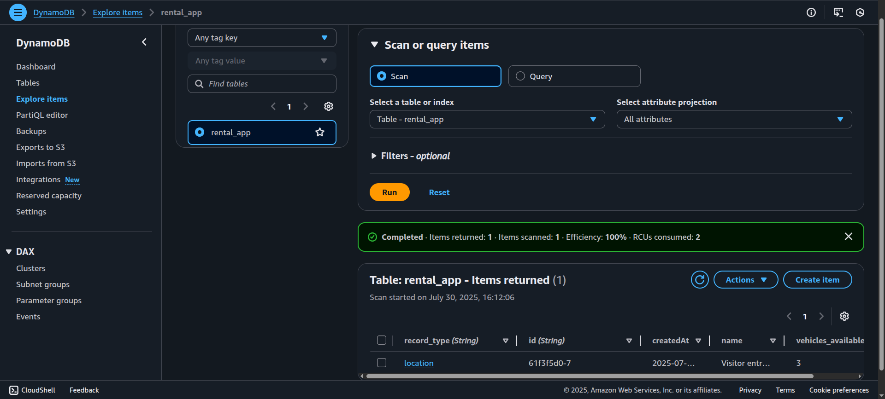
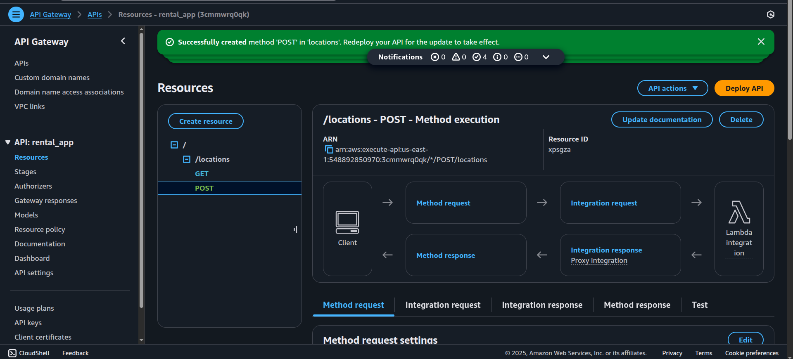
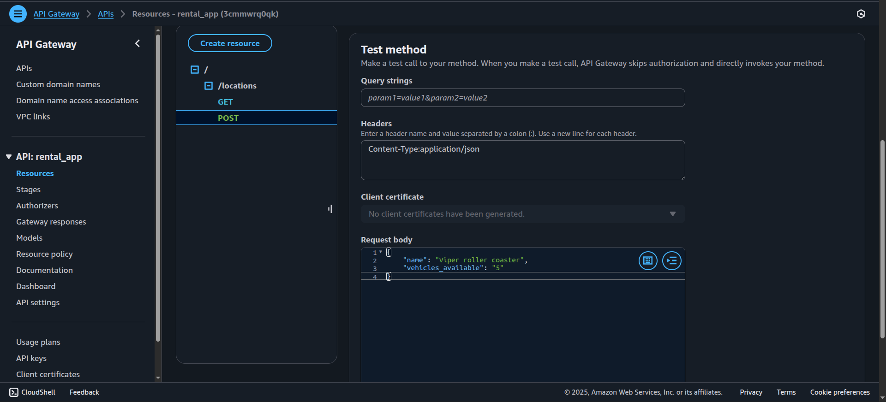
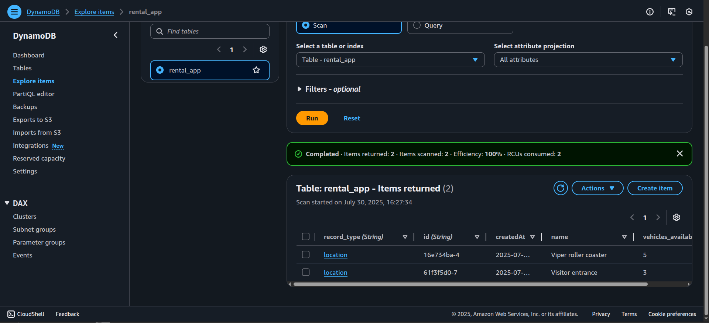
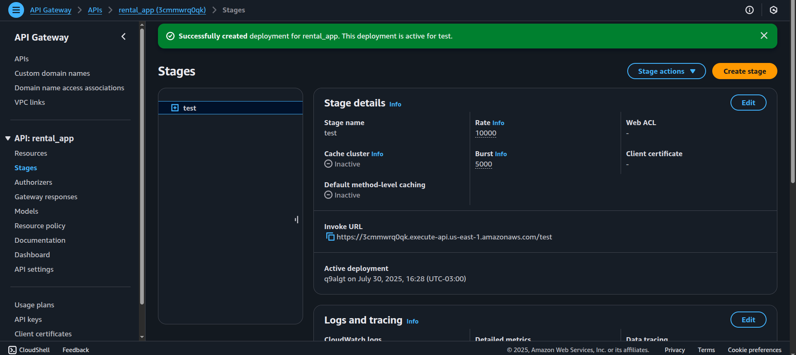

[README-dynamodb-lambda-api.md](https://github.com/user-attachments/files/21549579/README-dynamodb-lambda-api.md)

#  Proyecto: DynamoDB Serverless con Lambda y API Gateway

Este proyecto implementa una solución **serverless** que combina **Amazon DynamoDB**, **AWS Lambda** y **Amazon API Gateway** para crear, actualizar y consultar ítems en una base de datos NoSQL a través de una API RESTful.

---

##  Objetivo

- Crear una base de datos **NoSQL** en **Amazon DynamoDB**.
- Desarrollar una función **AWS Lambda** que permita crear, actualizar y listar ítems en la tabla.
- Implementar una **RESTful API** con **API Gateway** para interactuar con la función Lambda y la base de datos.

---

##  Servicios utilizados

| Servicio              | Función                                                               |
|-----------------------|-----------------------------------------------------------------------|
| **Amazon DynamoDB**   | Base de datos NoSQL para almacenar y consultar datos.                 |
| **AWS Lambda**        | Procesamiento serverless de las solicitudes de la API.                |
| **Amazon API Gateway**| Exposición de endpoints REST para interactuar con Lambda.             |

---

##  Pasos realizados

1. **Creación de la base de datos DynamoDB** llamada `rental_app` con:
   - **Partition Key:** `record_type`
   - **Sort Key:** `id`
   
   

2. **Creación de la función Lambda** e inserción del `sample_code` que incluye:
   - Crear ítems
   - Actualizar ítems
   - Listar ítems en la tabla DynamoDB
   
   

3. Configuración de una **environment variable** con el nombre de la tabla (`rental_app`).

   

4. Creación de un **test** en Lambda (`create_location`) y ejecución.

   
   
   

5. Verificación en DynamoDB mediante un **Scan Items**.

   

6. Creación de una nueva **REST API** en API Gateway.

   

7. Creación del recurso `/locations` con método **GET** integrado con Lambda.

   

8. Creación del método **POST** para crear ítems en DynamoDB, también integrado con Lambda.

   

9. Verificación de la creación del ítem en DynamoDB tras el test del método POST.

   

10. **Deploy** de la API en el stage `test`.

    

---

##  Código Lambda

El archivo `lambda_function.py` adjunto contiene la lógica para:
- Crear un nuevo ítem.
- Actualizar ítems existentes.
- Listar ítems desde DynamoDB.

---

##  Problemas encontrados y soluciones

*(No se registraron problemas técnicos durante la implementación.)*

---

##  Resultado esperado

- Endpoint **GET /locations** para listar ítems desde DynamoDB.
- Endpoint **POST /locations** para crear ítems en DynamoDB.
- Operaciones verificadas correctamente en DynamoDB.
